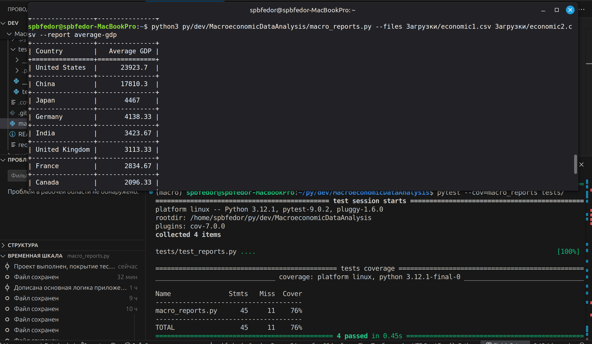

# Macroeconomic Data Analysis Tool

CLI-утилита для обработки CSV-файлов с макроэкономическими данными и формирования аналитических отчетов.

## 🛠 Стек технологий
- **Python 3.12** (Standard Library: `argparse`, `csv`, `collections`)
- **Tabulate** (Визуализация таблиц в консоли)
- **Pytest** & **Pytest-cov** (Тестирование и контроль покрытия)

## 🚀 Запуск и использование
Скрипт поддерживает объединение данных из нескольких файлов в один отчет.

```bash
# Установка зависимости для вывода таблиц
pip -r requirements.txt
```

## 🚀 Быстрый запуск
Для демонстрации работы в репозиторий включены тестовые данные в папке `data/`.
```bash
# Формирование отчета по двум файлам из комплекта
# Из директории проекта введите команду
python3 macro_reports.py --files data/economic1.csv data/economic2.csv --report average-gdp
```

## 📊 Пример работы


## 🛠 Расширение: как добавить новый отчет
Архитектура позволяет добавить новый тип аналитики за 3 шага без правки основного кода:

1. Создайте функцию в `macro_reports.py`, принимающую список путей к файлам.
2. Реализуйте в ней логику обработки данных и возврата списка списков.
3. Пометьте функцию декоратором `@register_report("имя-отчета")`.

После этого новый отчет автоматически станет доступен в параметре `--report` и отобразится в справке `--help`
